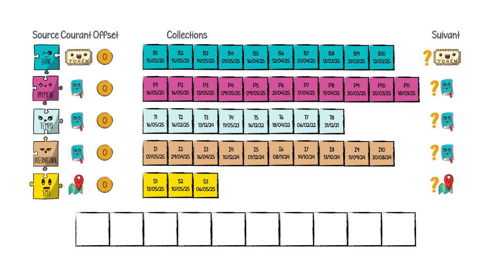

# Pagination multi source

## Abstract

Les banques en ligne gèrent un volume considérable de transactions financières, et le suivi des virements est crucial pour nos clients.

Dans le cadre de cette conférence, je partagerai mon expérience de mise en place d’une **pagination multi-source** afin d’améliorer l’expérience de suivi des virements.

Chez Boursobank, nous offrons à nos clients plusieurs méthodes pour exécuter des virements : classique, instantané, SMS et sous forme d’agrégateur bancaire. Chaque type de virement provient d’une source différente. Il est essentiel de réfléchir à une solution de pagination multi-source pour afficher les résultats de manière efficace.

La mise en place d’un tel système de pagination implique de gérer différentes sources de données, telles que les API de la banque et les bases de données internes, chacune avec leurs contraintes particulières. De plus, il est crucial d’optimiser les performances pour garantir une expérience utilisateur fluide.

Lors de cette présentation, je reviendrai sur :
- la manière dont nous avons combiné les données et comment nous les avons ordonnées,
- nos stratégies pour gérer les limites de pagination,
- comment nous avons utilisé le cache pour améliorer les performances.

---

- Slides : [slides.pdf](slides.pdf)
- Gif animé : 

